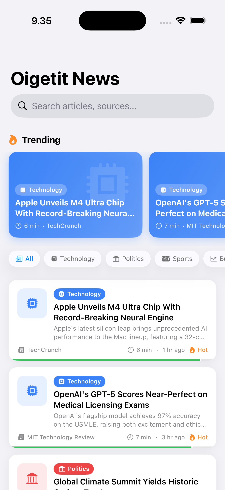
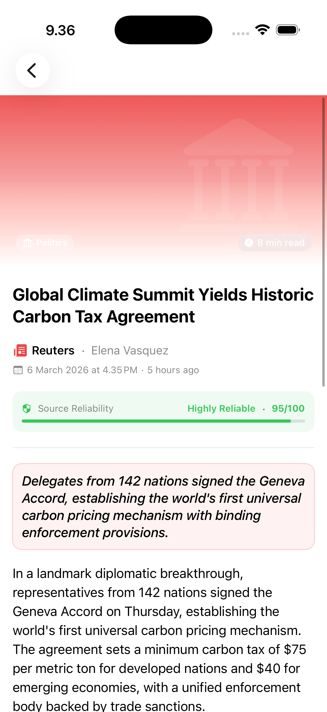

# News App

A SwiftUI news reader app inspired by [Oigetit](https://www.oigetit.com), built to demonstrate clean architecture, modern Swift concurrency, and iOS 26 design capabilities.

---

## Screenshots

<table>
  <tr>
    <td align="center">
      
      <br/>
      <sub><b>News Feed</b></sub>
      <br/>
      <sub>Trending carousel · category chips · article list with reliability bar</sub>
    </td>
    <td align="center">
      
      <br/>
      <sub><b>Category Filter</b></sub>
      <br/>
      <sub>Liquid glass chips · filtered article list</sub>
    </td>
    <td align="center">
      
      <br/>
      <sub><b>Article Detail</b></sub>
      <br/>
      <sub>Hero section · reliability score · summary · full content</sub>
    </td>
  </tr>
</table>

---

## Features

- **News feed** with trending carousel and full article list
- **Category filter** with liquid glass chips (iOS 26 `.glassEffect`)
- **Search** across title, source, and author
- **Article detail** with reliability score, read time, and full content
- **Shimmer skeleton** loading animation on both list and detail screens
- **Bookmark** toggle on article detail
- **Error state** with retry on all screens

---

## Architecture

The app follows **Clean Architecture** with three distinct layers, each depending only inward.

```
┌─────────────────────────────────────────┐
│            Presentation Layer           │
│   ViewModels · Views · Router · DI      │
├─────────────────────────────────────────┤
│              Domain Layer               │
│     Entities · Use Cases · Protocols    │
├─────────────────────────────────────────┤
│               Data Layer                │
│    Repository · DTOs · Data Sources     │
└─────────────────────────────────────────┘
```

### Presentation
- **MVVM** using `@Observable` macro (iOS 17+)
- `@State` owns `@Observable` ViewModels in SwiftUI views
- `AppRouter` — `@Observable` router holding `NavigationPath` for programmatic navigation
- `AppNavigationStack` — single `NavigationStack` root; all `navigationDestination` registrations and DI wiring live here
- `AppDependencies` — pure factory (composition root), only referenced from `NewsApp.swift` and `AppNavigationStack`

### Domain
- `Article` entity and `ArticleCategory` enum — core business model
- `ArticleRepositoryProtocol` — boundary between domain and data
- `FetchArticlesUseCase` and `FetchArticleDetailUseCase` — single-responsibility use cases
- `DomainError` — typed, `Equatable`, `LocalizedError`
- `ViewState<T>` — generic state enum: `.idle`, `.loading`, `.success(T)`, `.failure(String)`

### Data
- `ArticleDataSourceProtocol` — abstracts the data source from the repository
- `LocalArticleDataSource` — mock data source with simulated network delay
- `ArticleDTO` → `Article` mapping via `toDomain()`

---

## Navigation

Navigation uses a **typed router** pattern — views never reference other views directly.

```swift
// Any view navigates by pushing a route
router.push(.articleDetail(articleId: article.id))

// AppNavigationStack resolves routes in one place
.navigationDestination(for: AppRoute.self) { route in
    switch route {
    case .articleDetail(let id):
        ArticleDetailView(viewModel: appDependencies.makeArticleDetailViewModel(articleId: id))
    }
}
```

Adding a new screen requires only:
1. A new `case` in `AppRoute`
2. A new `case` in `AppNavigationStack`'s `switch`

---

## Design System

| Token | Value | Usage |
|-------|-------|-------|
| `Spacing.xxs` | 2pt | Hairline gaps, divider insets |
| `Spacing.xs` | 4pt | Tight inline gaps |
| `Spacing.sm` | 8pt | Inner padding, small gaps |
| `Spacing.md` | 12pt | Card padding, chip padding |
| `Spacing.lg` | 16pt | Standard screen margin |
| `Spacing.xl` | 20pt | Section spacing, hero insets |
| `Spacing.xxl` | 24pt | Large section gaps |
| `Spacing.xxxl` | 32pt | Between major layout blocks |
| `Spacing.huge` | 40pt | Screen-level bottom padding |
| `Spacing.massive` | 48pt | Extra-large decorative gaps |

All spacing values are visible in the `Spacing.swift` Xcode preview.

---

## Tech Stack

| | |
|---|---|
| **Language** | Swift 5.10 |
| **UI** | SwiftUI |
| **Minimum target** | iOS 26 |
| **Concurrency** | Swift Concurrency (`async`/`await`) |
| **State management** | `@Observable` macro |
| **Testing** | Swift Testing framework |
| **Design** | iOS 26 Liquid Glass (`.glassEffect`) |

---

## Project Structure

```
News App/
├── App/
│   ├── AppDependencies.swift       # Composition root / DI factory
│   ├── AppNavigationStack.swift    # Single NavigationStack root
│   ├── AppRoute.swift              # Typed navigation destinations
│   └── AppRouter.swift             # Observable router
│
├── Domain/
│   ├── Entities/
│   │   └── Article.swift           # Article + ArticleCategory
│   ├── Errors/
│   │   └── DomainError.swift
│   ├── Repositories/
│   │   └── ArticleRepositoryProtocol.swift
│   └── UseCases/
│       ├── FetchArticlesUseCase.swift
│       └── FetchArticleDetailUseCase.swift
│
├── Data/
│   ├── DTOs/
│   │   └── ArticleDTO.swift
│   ├── DataSources/
│   │   ├── ArticleDataSourceProtocol.swift
│   │   └── LocalArticleDataSource.swift
│   └── Repositories/
│       └── ArticleRepository.swift
│
└── Presentation/
    ├── Common/
    │   ├── ViewState.swift
    │   ├── Components/             # ArticleCardView, TrendingCardView, etc.
    │   ├── DesignSystem/           # Spacing, ShimmerModifier
    │   └── Previews/               # Article+Mock (shared fixture)
    ├── NewsList/
    │   ├── NewsListView.swift
    │   ├── NewsListViewModel.swift
    │   └── Views/                  # NewsListContentView, NewsListLoadingView, CategoryFilterBarView
    └── ArticleDetail/
        ├── ArticleDetailView.swift
        ├── ArticleDetailViewModel.swift
        └── Views/                  # ArticleDetailContentView, ArticleDetailLoadingView

News AppTests/
├── Mocks.swift                     # Shared test doubles and fixtures
├── ArticleDTOTests.swift
├── ArticleRepositoryTests.swift
├── UseCaseTests.swift
├── NewsListViewModelTests.swift
└── ArticleDetailViewModelTests.swift
```

---

## Testing

40 unit tests written with the **Swift Testing** framework covering all three layers.

```
swift test
```

Or press `Cmd+U` in Xcode.

| Suite | Coverage |
|---|---|
| `ArticleDTOTests` | Field mapping, all category cases, unknown category fallback |
| `ArticleRepositoryTests` | DTO→domain mapping, empty result, error propagation, fetch by id |
| `FetchArticlesUseCaseTests` | Delegates to repository, propagates errors |
| `FetchArticleDetailUseCaseTests` | Delegates to repository, not found, error propagation |
| `NewsListViewModelTests` | State transitions, idle guard, retry, category filter, search, trending |
| `ArticleDetailViewModelTests` | State transitions, retry, bookmark toggle, derived state |

All ViewModel test suites are `@MainActor` for Swift 6 compatibility.

---

## Getting Started

1. Clone the repo
2. Open `News App.xcodeproj` in Xcode 26+
3. Select a simulator running iOS 26
4. Press `Cmd+R` to run

No dependencies, no package manager setup required.
